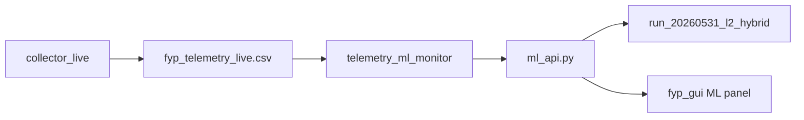

# Further improvement and guardrails (1-day, balanced)

## Current baseline

**Working today:** sim-L2/L3/L4, L4 spikes, calibration, logs in `/tmp/fyp-demo/`, `IGNORE_LEVELS=2` for idle.

**Pain points from this session:**
- Idle false positives from **roll-L3** / spike rules (now off by default, but easy to re-break).
- Dashboard shows high **L2 score** while title says another level — confuses examiners.
- No automated “is demo healthy?” check before presentation.
- `l2_behavioral` training helpers and eval scripts were discussed but are **not** in the tree (only artifacts + supplement CSVs remain).

**Constraint:** No new telemetry collection; ~1 day implementation.

---

## Design principle: demo-safe profile

Introduce a single **demo-safe** configuration (env file + defaults) that is the only profile used for `start_demo_stack.sh` / `run_demo_verbose.sh`:

| Rule | Setting | Why |
|------|---------|-----|
| L2 alerts | `FYP_ML_IGNORE_LEVELS=2` | L2 score noisy on demo VM |
| L2/L3 spikes | `FYP_ML_L2_SPIKES=0`, `FYP_ML_L3_SPIKES=0`, `FYP_ML_L3_ROLLING=0` | Proven idle FP source |
| L4 spikes | `FYP_ML_L4_SPIKES=1` | L4 sim still strong |
| Sim detect | `FYP_ML_SIM_DETECT=1` | Reliable L2/L3 demo path |
| ML L2/L3 | High deltas only (`L2_DELTA=0.55`, `L3_DELTA=0.20`) | Only if spikes stay off |

Optional **research profile** (document only, not default): enable L3 rolling with auto thresholds derived from post-calibration kernel baselines — not for examiner day.

---

## Phase 1 — Guardrails (highest priority, ~4–5 h)

### 1.1 Calibration lockout in API

**File:** [`scripts/ml_api.py`](scripts/ml_api.py)

- While `not _calibration_done`: force `label=benign`, `detection_mode=calibrating`, never set `raw_malicious` from spikes/ML/delta.
- Expose `calibrating: bool` and `calibration_progress: "12/20"` on `/health` and `PredictResponse`.
- Skip sim-detect during calibration (avoid calibrating while a sim is already running).

### 1.2 GUI clarity (examiner-facing)

**File:** [`gui/fyp_gui.py`](gui/fyp_gui.py) — `on_ml_prediction`

Split what the user sees:

- **Title:** `System Clean` / `Keylogger Detected — Level N` (from `label` + `level` only).
- **Subtitle:** `Detection: sim-L3` (from `detection_mode`) — not confused with raw L2.
- **Scores line:** `Model scores (info): L2=… L3=… L4=…` with note when `2 in IGNORE_LEVELS`.
- **Calibrating state:** yellow panel “Calibrating… (N/20)” until API reports `calibrated=true`.

### 1.3 Startup smoke test

**New file:** `scripts/demo_smoke_test.sh`

Headless checks (no GUI):

1. `curl /health` — correct `run_dir`, `ignore_levels`, eventually `calibrated`.
2. POST 20 benign-like rows from [`dataset/l2_supplement/demo_vm_benign.csv`](dataset/l2_supplement/demo_vm_benign.csv) — assert all `label=benign`.
3. Optional: POST one high-openat row — assert still benign when spikes off.
4. Exit non-zero + clear message on failure.

Wire into [`scripts/run_demo_verbose.sh`](scripts/run_demo_verbose.sh) after stack start (sleep 12s, run smoke test).

### 1.4 Demo-safe env file

**New file:** `scripts/demo_safe.env` (sourced by `start_demo_stack.sh`)

- Centralize all ML env defaults (single source of truth).
- Comment each variable with “do not enable for examiner demo” where relevant.

### 1.5 Pre-flight checklist doc section

**File:** [`docs/SESSION_RESUME.md`](docs/SESSION_RESUME.md) — add **“1-day demo checklist”**:

- stop → start verbose → smoke test pass → idle clean 30s → run each sim → export logs.

---

## Phase 2 — Low-risk ML wins (~2–3 h)

### 2.1 Sim-gated optional rules (no idle FP)

**File:** [`scripts/ml_api.py`](scripts/ml_api.py)

- New flag: `FYP_ML_SPIKES_REQUIRE_SIM=1` (default **on** in demo-safe).
- When set: `spike-L*` and `roll-L*` only apply if `sim_active` **or** `per_level_adjusted` for that level exceeds 2× normal delta (escape hatch for research).

This lets you experiment later without breaking idle demo.

### 2.2 L2 score context without L2 alerts

Keep `IGNORE_LEVELS=2` but add to API response:

- `l2_display: "informational"` 
- `l2_note: "score only; detection via sim-L2"`

GUI shows a small footnote when L2 raw > 0.4 but `label=benign`.

### 2.3 Restore minimal offline eval (no training run)

**New file:** `scripts/evaluate_l2.py` (lightweight)

- Load `run_20260529_193015` vs `run_20260531_l2_hybrid` level_2 only.
- Score `dataset/l2_supplement/*.csv` + median benign row.
- Print table for thesis appendix (proves tuning helped idle).

**Skip** full retrain in 1-day window unless smoke test finishes early.

---

## Phase 3 — Backlog (after demo / if time remains)

Not in the 1-day scope; document in [`docs/ml_work.md`](docs/ml_work.md) §Backlog:

| Item | Effort | Needs capture? |
|------|--------|----------------|
| L3 `l3_behavioral` retrain + supplement | ½ day | Optional bootstrap from live CSV |
| eBPF `stat()` / UDP DNS probes | 1–2 days | No for stat; yes to validate DNS |
| `capture_l2_unseen.py` + sudo capture | ½ day | Yes |
| ML Insights score history in GUI | 1 day | No |
| Unit tests for `predict()` with fixture rows | ½ day | No |
| Auto-threshold from calibration percentiles (p95 + margin) | ½ day | No |

---

## Acceptance criteria (1-day done)

1. After `sudo scripts/run_demo_verbose.sh`, smoke test passes; GUI shows **Calibrating** then **System Clean** for 30s idle.
2. `fyp_ml_decisions.log` shows only `BENIGN | mode=idle` or `mode=calibrating` at idle (no `roll-L3` / `spike-L2`).
3. Each unseen sim produces `sim-LN` and red panel within ~2s.
4. Examiner can read **Detection: sim-L3** separately from **L2 score** on dashboard.
5. [`docs/SESSION_RESUME.md`](docs/SESSION_RESUME.md) has updated checklist + demo-safe env reference.

---

## Suggested implementation order

1. `demo_safe.env` + calibration lockout in API  
2. GUI calibrating / detection_mode display  
3. `demo_smoke_test.sh` + hook in `run_demo_verbose.sh`  
4. Sim-gated spikes flag  
5. `evaluate_l2.py` + doc touch-up  

No git commit unless you ask; test on VM with full stop/restart after each logical chunk.
